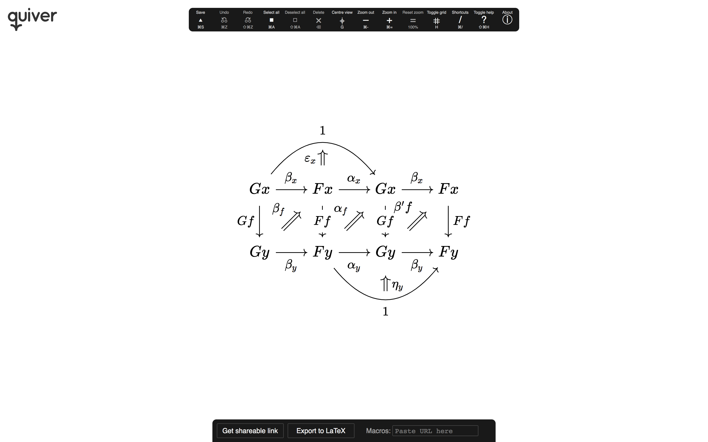

# quiver: a modern commutative diagram editor

[](https://q.uiver.app)

**quiver** is a modern, graphical editor for [commutative] and [pasting diagrams], capable of
rendering high-quality diagrams for screen viewing, and exporting to LaTeX via [tikz-cd].

Creating and modifying diagrams with **quiver** is orders of magnitude faster than writing the
equivalent LaTeX by hand and, with a little experience, competes with pen-and-paper.

[commutative]: https://en.wikipedia.org/wiki/Commutative_diagram
[pasting diagrams]: https://ncatlab.org/nlab/show/pasting+diagram
[tikz-cd]: https://github.com/astoff/tikz-cd

Try **quiver** out: [q.uiver.app](https://q.uiver.app)

## Features & screenshots

**quiver** features an efficient, intuitive interface for creating complex commutative diagrams and
pasting diagrams. It's easy to draw diagrams involving pullbacks and pushouts,

[](http://q.uiver.app/?q=WzAsNSxbMSwyLCJBIl0sWzIsMSwiQiJdLFsyLDIsIkMiXSxbMSwxLCJBIFxcdGltZXNfQyBCIl0sWzAsMCwiWCJdLFswLDIsImYiLDJdLFsxLDIsImciXSxbMywwLCJcXHBpXzEiLDJdLFszLDEsIlxccGlfMiJdLFs0LDAsImEiLDIseyJjdXJ2ZSI6M31dLFs0LDEsImIiLDAseyJjdXJ2ZSI6LTN9XSxbNCwzLCJcXGxhbmdsZSBhLCBiIFxccmFuZ2xlIiwxLHsic3R5bGUiOnsiYm9keSI6eyJuYW1lIjoiZGFzaGVkIiwibGV2ZWwiOjF9fX1dLFszLDIsIiIsMSx7InN0eWxlIjp7Im5hbWUiOiJjb3JuZXIifX1dXQ==)

adjunctions,

[](https://q.uiver.app/?q=WzAsMixbMCwwLCJcXG1hdGhzY3IgQyJdLFsyLDAsIlxcbWF0aHNjciBEIl0sWzAsMSwiRiIsMCx7ImN1cnZlIjotMn1dLFsxLDAsIkciLDAseyJjdXJ2ZSI6LTJ9XSxbMiwzLCIiLDAseyJsZXZlbCI6MSwic3R5bGUiOnsibmFtZSI6ImFkanVuY3Rpb24ifX1dXQ==)

and higher cells.

[](https://q.uiver.app/?q=WzAsNCxbMCwwLCJYJyJdLFsxLDAsIlgiXSxbNCwwLCJZIl0sWzUsMCwiWSciXSxbMCwxLCJ4Il0sWzIsMywieSIsMl0sWzEsMiwiIiwwLHsiY3VydmUiOi0yfV0sWzEsMiwiIiwyLHsiY3VydmUiOjJ9XSxbMCwzLCJmJyIsMCx7ImN1cnZlIjotNX1dLFswLDMsImcnIiwyLHsiY3VydmUiOjV9XSxbOCw2LCJcXHZhcnBoaSIsMix7Imxlbmd0aCI6NzB9XSxbNyw5LCJcXGdhbW1hIiwwLHsibGVuZ3RoIjo3MH1dLFs2LDcsIlxcY2hpIiwyLHsib2Zmc2V0Ijo1LCJsZW5ndGgiOjcwfV0sWzYsNywiXFx1cHNpbG9uIiwwLHsib2Zmc2V0IjotNSwibGVuZ3RoIjo3MH1dLFsxMiwxMywiXFxtdSIsMCx7Imxlbmd0aCI6NzB9XV0=)

Object placement is based on a flexible grid that resizes according to the size of the labels.

[](https://q.uiver.app/?q=WzAsMyxbMCwwLCIoQSBcXG90aW1lcyBJKSBcXG90aW1lcyBCIl0sWzIsMCwiQSBcXG90aW1lcyAoSSBcXG90aW1lcyBCKSJdLFsxLDEsIkEgXFxvdGltZXMgQiJdLFswLDIsIlxccmhvX0EgXFxvdGltZXMgQiIsMl0sWzEsMiwiQSBcXG90aW1lcyBcXGxhbWJkYV9CIl0sWzAsMSwiXFxhbHBoYV97QSwgSSwgQn0iXV0=)

[](https://q.uiver.app/?q=WzAsMTYsWzAsMCwiXFxidWxsZXQiXSxbMSwwLCJcXGJ1bGxldCJdLFswLDEsIlxcYnVsbGV0Il0sWzEsMSwiXFxidWxsZXQiXSxbMCwyLCJcXGJ1bGxldCJdLFsxLDIsIlxcYnVsbGV0Il0sWzAsMywiXFxidWxsZXQiXSxbMSwzLCJcXGJ1bGxldCJdLFszLDAsIlxcYnVsbGV0Il0sWzIsMCwiXFxidWxsZXQiXSxbMywxLCJcXGJ1bGxldCJdLFsyLDEsIlxcYnVsbGV0Il0sWzMsMiwiXFxidWxsZXQiXSxbMiwyLCJcXGJ1bGxldCJdLFszLDMsIlxcYnVsbGV0Il0sWzIsMywiXFxidWxsZXQiXSxbMCwxLCIiLDAseyJzdHlsZSI6eyJ0YWlsIjp7Im5hbWUiOiJtb25vIn0sImJvZHkiOnsibmFtZSI6ImRhc2hlZCIsImxldmVsIjoxfX19XSxbMiwzLCIiLDAseyJzdHlsZSI6eyJ0YWlsIjp7Im5hbWUiOiJtYXBzIHRvIn0sImJvZHkiOnsibmFtZSI6ImRvdHRlZCIsImxldmVsIjoxfSwiaGVhZCI6eyJuYW1lIjoiZXBpIn19fV0sWzQsNSwiIiwwLHsic3R5bGUiOnsidGFpbCI6eyJuYW1lIjoiaG9vayIsInNpZGUiOiJ0b3AifSwiYm9keSI6eyJuYW1lIjoic3F1aWdnbHkiLCJsZXZlbCI6MX0sImhlYWQiOnsibmFtZSI6ImhhcnBvb24iLCJzaWRlIjoidG9wIn19fV0sWzYsNywiIiwwLHsic3R5bGUiOnsidGFpbCI6eyJuYW1lIjoiaG9vayIsInNpZGUiOiJib3R0b20ifSwiYm9keSI6eyJuYW1lIjoiYmFycmVkIiwibGV2ZWwiOjF9LCJoZWFkIjp7Im5hbWUiOiJoYXJwb29uIiwic2lkZSI6ImJvdHRvbSJ9fX1dLFs4LDksImYiLDIseyJvZmZzZXQiOjJ9XSxbOCw5LCJnIiwwLHsib2Zmc2V0IjotMn1dLFsxMCwxMSwiIiwwLHsibGV2ZWwiOjIsInN0eWxlIjp7ImJvZHkiOnsibmFtZSI6InNxdWlnZ2x5IiwibGV2ZWwiOjF9fX1dLFsxMiwxMywiIiwwLHsibGVuZ3RoIjoyMCwic3R5bGUiOnsiYm9keSI6eyJsZXZlbCI6MX19fV0sWzE0LDE1LCIiLDAseyJjdXJ2ZSI6MiwibGV2ZWwiOjMsInN0eWxlIjp7ImJvZHkiOnsibmFtZSI6ImJhcnJlZCIsImxldmVsIjoxfSwiaGVhZCI6eyJuYW1lIjoiZXBpIn19fV1d)

There is a wide range of composable arrow styles.

[](https://q.uiver.app/?q=WzAsNSxbMSwxLCJBIFxcdGltZXNfQyBCIixbMCw2MCw2MCwxXV0sWzIsMSwiQiIsWzI0MCw2MCw2MCwxXV0sWzEsMiwiQSIsWzI0MCw2MCw2MCwxXV0sWzIsMiwiQyIsWzI0MCw2MCw2MCwxXV0sWzAsMCwiWCIsWzEyMCw2MCw2MCwxXV0sWzAsMSwiIiwwLHsiY29sb3VyIjpbMCw2MCw2MF19XSxbMCwyLCIiLDIseyJjb2xvdXIiOlswLDYwLDYwXX1dLFsyLDMsImciLDIseyJjb2xvdXIiOlsyNDAsNjAsNjBdfSxbMTgwLDYwLDYwLDFdXSxbMSwzLCJmJyIsMCx7ImNvbG91ciI6WzI0MCw2MCw2MF19LFsxODAsNjAsNjAsMV1dLFswLDMsIiIsMCx7ImNvbG91ciI6WzAsNjAsNjBdLCJzdHlsZSI6eyJuYW1lIjoiY29ybmVyIn19XSxbNCwyLCJhIiwyLHsiY3VydmUiOjIsImNvbG91ciI6WzEyMCw2MCw2MF19LFs2MCw2MCw2MCwxXV0sWzQsMSwiYiIsMCx7ImN1cnZlIjotMiwiY29sb3VyIjpbMTIwLDYwLDYwXX0sWzYwLDYwLDYwLDFdXSxbNCwwLCIiLDEseyJjb2xvdXIiOlszMDAsNjAsNjBdLCJzdHlsZSI6eyJib2R5Ijp7Im5hbWUiOiJkYXNoZWQifX19XV0=)

And full use of colour for labels and arrows.

[](https://q.uiver.app/?q=WzAsOCxbMCwwLCJHeCJdLFsxLDAsIkZ4Il0sWzIsMCwiR3giXSxbMywwLCJGeCJdLFswLDEsIkd5Il0sWzEsMSwiRnkiXSxbMiwxLCJHeSJdLFszLDEsIkZ5Il0sWzAsMSwiXFxiZXRhX3giXSxbMSwyLCJcXGFscGhhX3giXSxbMiwzLCJcXGJldGFfeCJdLFswLDQsIkdmIiwyXSxbNCw1LCJcXGJldGFfeSIsMl0sWzUsNiwiXFxhbHBoYV95IiwyXSxbNiw3LCJcXGJldGFfeSIsMl0sWzMsNywiRmYiXSxbMSw1LCJGZiIsMV0sWzIsNiwiR2YiLDFdLFs0LDEsIlxcYmV0YV9mIiwwLHsic2hvcnRlbiI6eyJzb3VyY2UiOjIwLCJ0YXJnZXQiOjIwfSwibGV2ZWwiOjJ9XSxbNSwyLCJcXGFscGhhX2YiLDAseyJzaG9ydGVuIjp7InNvdXJjZSI6MjAsInRhcmdldCI6MjB9LCJsZXZlbCI6Mn1dLFs2LDMsIlxcYmV0YSdmIiwwLHsic2hvcnRlbiI6eyJzb3VyY2UiOjIwLCJ0YXJnZXQiOjIwfSwibGV2ZWwiOjJ9XSxbMCwyLCIxIiwwLHsiY3VydmUiOi00fV0sWzUsNywiMSIsMix7ImN1cnZlIjo0fV0sWzEsMjEsIlxcdmFyZXBzaWxvbl94IiwwLHsic2hvcnRlbiI6eyJ0YXJnZXQiOjMwfX1dLFsyMiw2LCJcXGV0YV95IiwyLHsic2hvcnRlbiI6eyJzb3VyY2UiOjMwfX1dXQ==)

**quiver** is intended to look good for screenshots, as well as to export LaTeX that looks as close
as possible to the original diagram.

[](https://q.uiver.app/?q=WzAsMixbMCwwLCJBIl0sWzEsMCwiQiJdLFswLDEsImYiXV0=)

Diagrams may be created and modified using either the mouse, by clicking and dragging, or using the keyboard, with a complete set of keyboard shortcuts for performing any action.

[](https://q.uiver.app/?q=WzAsOCxbMCwwLCJHeCJdLFsxLDAsIkZ4Il0sWzIsMCwiR3giXSxbMywwLCJGeCJdLFswLDEsIkd5Il0sWzEsMSwiRnkiXSxbMiwxLCJHeSJdLFszLDEsIkZ5Il0sWzAsMSwiXFxiZXRhX3giXSxbMSwyLCJcXGFscGhhX3giXSxbMiwzLCJcXGJldGFfeCJdLFswLDQsIkdmIiwyXSxbNCw1LCJcXGJldGFfeSIsMl0sWzUsNiwiXFxhbHBoYV95IiwyXSxbNiw3LCJcXGJldGFfeSIsMl0sWzMsNywiRmYiXSxbMSw1LCJGZiIsMV0sWzIsNiwiR2YiLDFdLFs0LDEsIlxcYmV0YV9mIiwwLHsibGVuZ3RoIjo1MCwibGV2ZWwiOjJ9XSxbNSwyLCJcXGFscGhhX2YiLDAseyJsZW5ndGgiOjUwLCJsZXZlbCI6Mn1dLFs2LDMsIlxcYmV0YSdmIiwwLHsibGVuZ3RoIjo1MCwibGV2ZWwiOjJ9XSxbMCwyLCIxIiwwLHsiY3VydmUiOi00fV0sWzUsNywiMSIsMix7ImN1cnZlIjo0fV0sWzEsMjEsIlxcdmFyZXBzaWxvbl94IiwwLHsibGVuZ3RoIjo1MH1dLFsyMiw2LCJcXGV0YV95IiwyLHsibGVuZ3RoIjo1MH1dXQ==)

When you export diagrams to LaTeX, **quiver** will embed a link to the diagram, which will allow you
to return to it later if you decide it needs to be modified, or to share it with others.

### Other features
- Multiple selection, making mass changes easy and fast.
- A history system, allowing you to undo/redo actions.
- Support for custom macro definitions: simply paste a URL corresponding to the file containing your `\newcommand`s.
- Panning and zooming, for large diagrams.
- Smart label alignment and edge offset.

## Importing macros and colours

To use custom macros and colours in **quiver**, create a file containing the definitions, like the
following.

```latex
\newcommand{\cat}{\mathscr}
\newcommand{\psh}{\widehat}
\newcommand{\smcat}{\mathbb}
\newcommand{\yo}{よ}
```

Upload the file to a publicly accessible URL (for instance,
[gist.github.com](https://gist.github.com/)), and paste the URL for the raw text into the "Macros"
input at the bottom of **quiver**.

Currently, macros may be defined using `\newcommand`, and colours may be defined using
`\definecolor` (using the colour modes: `rgb`, `RGB` or `gray`).

## Building
Run `make` from the command land, and then open `src/index.html` in your favourite web browser.

If this fails, you might be using an incompatible version of Make or Bash. In this case, you can
manually download the [latest release](https://github.com/KaTeX/KaTeX/releases) of KaTeX and place
it under `src/` as `src/KaTeX/`. Then open `src/index.html` in your favourite web browser. If KaTeX
has not been given the correct path, you will get an error telling you that KaTeX failed to load.

If you have any other problems building **quiver**, [open an
issue](https://github.com/varkor/quiver/issues/new) detailing the problem and I'll try to help.

## Thanks to
- [S. C. Steenkamp](https://www.cl.cam.ac.uk/~scs62/) , for helpful discussions regarding the
aesthetic rendering of arrows.
- [AndréC](https://tex.stackexchange.com/users/138900/andr%c3%a9c) for the custom TikZ style for
curves of a fixed height.
- Everyone who has improved **quiver** by reporting issues or suggesting improvements.
