# **quiver** tutorial

**quiver** is designed to be easy to use either using both the mouse and the keyboard, or entirely using the keyboard. If you're just starting with **quiver**, it is probably easier to begin by using the mouse, and then slowly integrate more keyboard shortcuts into your workflow as you get more experienced.

## Basic navigation

When you open a new **quiver** page, you will be greeted by an empty canvas, with a blue
**focus point** at the centre of the window.

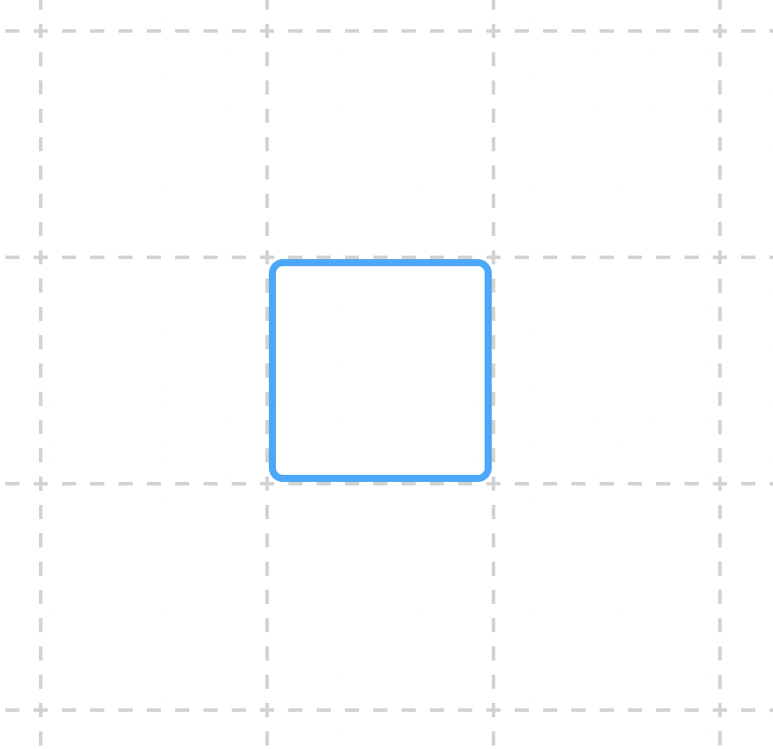

The focus point highlights the **grid cell** that is currently focused for keyboard navigation. If you are using the mouse to create or modify a diagram, the focus point will disappear as soon as you click somewhere on the canvas. (The focus point will reappear if you press a key for navigation, like <kbd>←</kbd><kbd>↑</kbd><kbd>→</kbd><kbd>↓</kbd>).

There are two ways to create a new object:

- You can double-click on an empty grid cell to create a new object in that cell.
- You can press <kbd>Space</kbd> to create a new object in the focused cell.

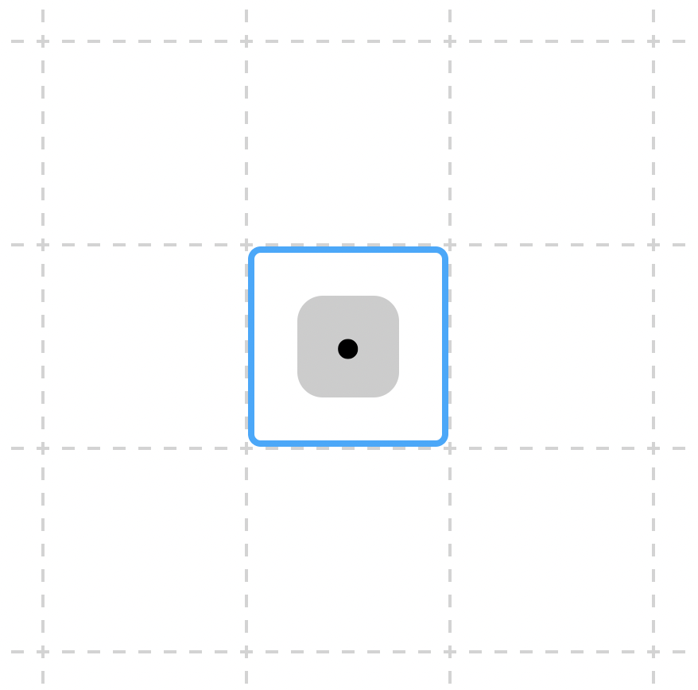

When you create a new object, it will be selected (as indicated by the grey background).

- If you single-click on an object when it is selected, you will focus the **text input**, where you can modify the object's label. Alternatively, you can press <kbd>Enter</kbd>.
- Once you have finished editing the label, you can single-click on the object again, or press <kbd>Enter</kbd>, to defocus the text input.
- To deselect an object, you can click anywhere on the canvas, or press <kbd>Escape</kbd>.

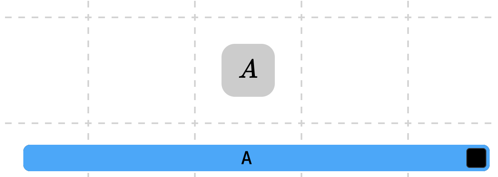

To create a new object, you can use either of the same methods as before (there are also a few other options, which we will cover shortly).

- You can double-click on an empty grid cell to create a new object, just like before.
- Alternatively, you can navigate the focus point to a new empty grid cell with the arrow keys (<kbd>←</kbd><kbd>↑</kbd><kbd>→</kbd><kbd>↓</kbd>), press <kbd>Escape</kbd> to deselect the previous object, and then press <kbd>Space</kbd> as before.

Next, we'd like to create an arrow between two objects. Again, we can do this either using the mouse or using the keyboard.

- To use the mouse, click down on one object and drag the mouse (without releasing) to the second object, and then release the mouse button.
- To use the keyboard, navigate to the first object with the arrow keys and press <kbd>Space</kbd> to select it. Then (without deselecting the first obejct), navigate to the second object with the arrow keys and press <kbd>Space</kbd>.

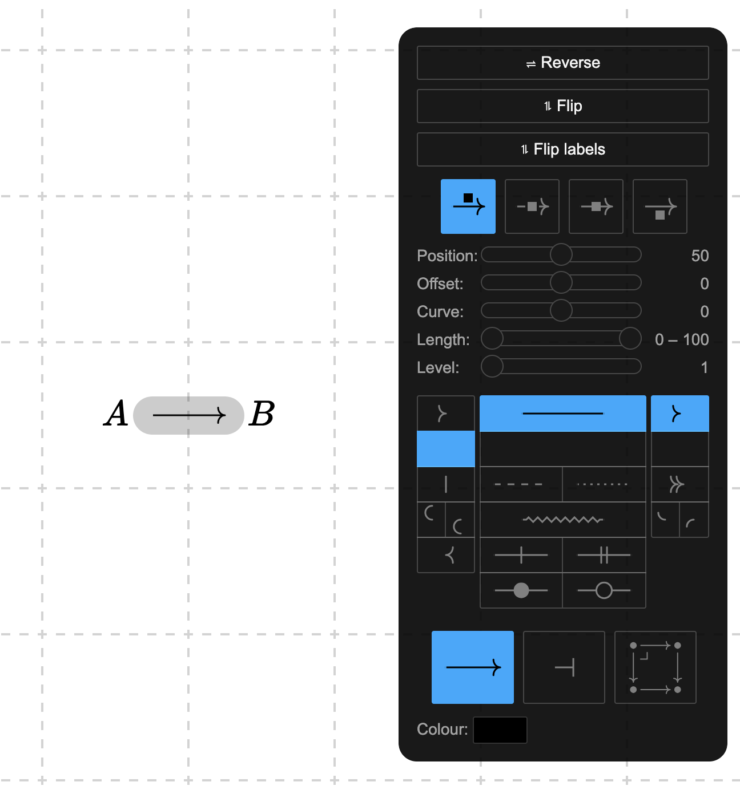

You can edit the label of an arrow in exactly the same way as the label of an object.

The panel that appears on the right when an edge is selected allows you to style the arrow. Play around with the different options by clicking with the mouse to see what they each do. You can also use the keyboard to navigate the side panel. To see which buttons are used to control each setting, it is helpful to switch on the **Hints** feature, which displays the keyboard shortcuts associated to each button. You can find this in the **Settings** menu in the **toolbar** at the top of the window.

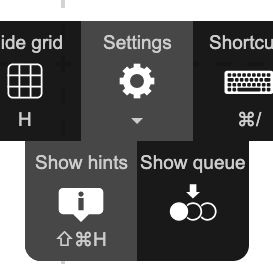

Alternatively, you can press the keyboard shortcut for toggling hints (<kbd>⇧⌘H</kbd> or <kbd>^⌘H</kbd> depending on your operating system).

Now, you will see each of the interface elements in the side panel annotated with the key that triggers it. (You will notice that hints also appear on other parts of the window, but we'll get to these later.) To deselect any interface element, simply press <kbd>Escape</kbd>.

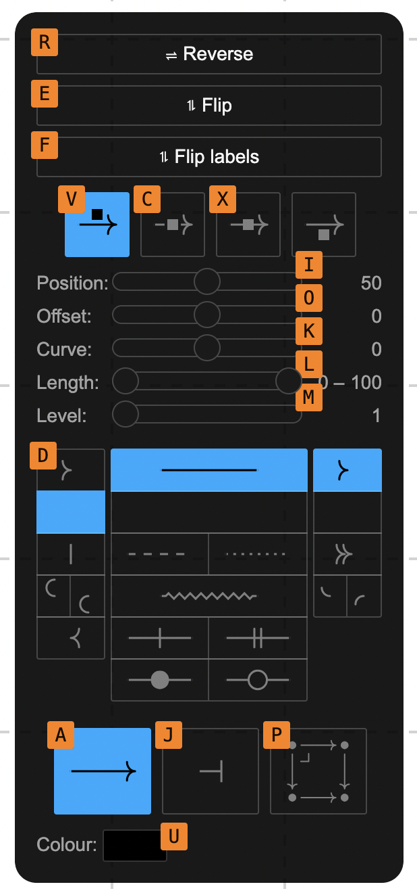

Now, let's create another object and arrow. This time, we'll create both in one go.

- Using the mouse, click and drag on one object and release in an empty grid cell to create a new object in that grid cell, together with an arrow from the object you clicked on to the new object.
- Using the keyboard, navigate to the first object with the arrow keys and press <kbd>Space</kbd> to select it. Then (without deselecting the first obejct), navigate to an empty grid cell with the arrow keys and press <kbd>Space</kbd>.

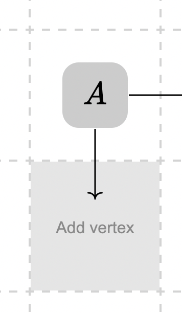

In fact, it's not even necessary to start with an existing object. You can click and drag from one empty grid cell to another to create a source object, target object, and edge between them all in one go.

In this way, it's very easy to create entire diagrams very quickly.

- With the mouse, you rarely need to double-click: simply click and drag repeatedly to create new objects and edges.
- With the keyboard, repeatedly navigate with the arrow keys and press space to create new objects and edges. If you don't want a new object to be connected to the previous one, press <kbd>Escape</kbd> to deselect any previous objects.

We've already seen how to select objects with both the mouse and the keyboard. It's just as simple to select objects with the mouse: simply click on the edge you want to select.

- You can select multiple objects and edges at once by holding <kbd>Shift</kbd> while clicking, which allows you to edit them simultaneously.
- Similarly, you can select multiple objects by holding <kbd>Shift</kbd> while pressing <kbd>Space</kbd> (which creates an edge to the newly selected object) or pressing <kbd>S</kbd> (which simply selects/deselects the object under the focus point without creating a new edge).

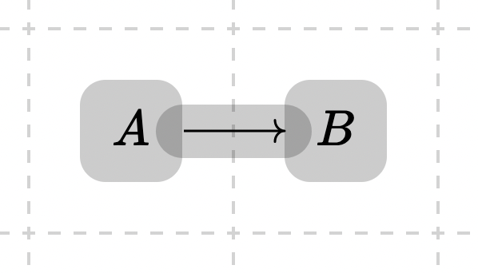

Selecting edges with the keyboard requires us to learn a powerful new trick. Press <kbd>;</kbd> at any time to bring up the **Selection Bar**. When you press this, you will see an orange bar appear at the bottom of the window, and orange labels appear on top of each of the objects and arrows in the diagram.

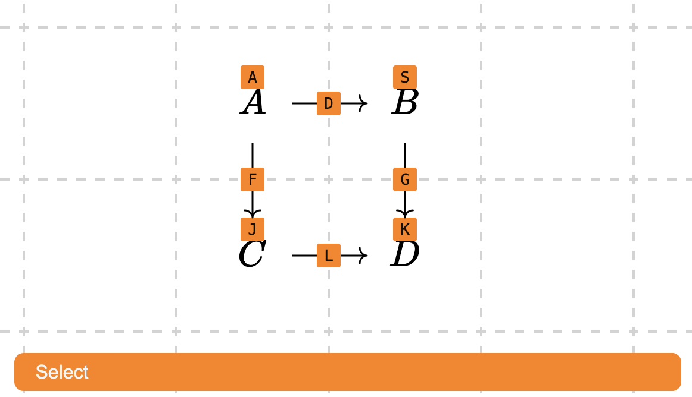

Now, type any of the letters corresponding to the orange labels above each object and arrow. You can also input multiple labels, separated by spaces. When you press <kbd>Enter</kbd>, the objects and arrows you typed will be selected. (Alternatively, you can press <kbd>'</kbd>, which will toggle the selection of the labels you type, rather than only selecting.)

We can create arrows between arrows, as well as between objects.

- With the mouse, click and drag from one arrow to another.
- With the keyboard, select the first edge using <kbd>;</kbd> or <kbd>'</kbd>, press <kbd>/</kbd> (to trigger creating a new edge from the selected one), type the label of the edge to draw an arrow to, and press <kbd>Enter</kbd>.

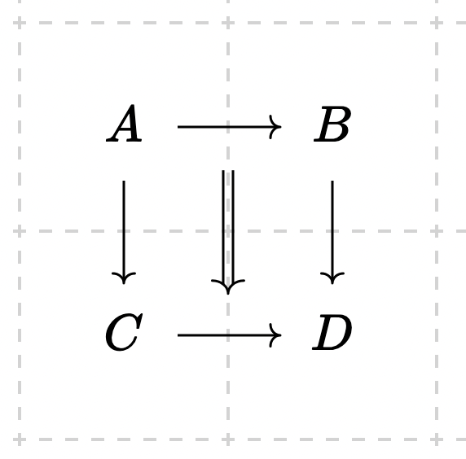

At any time, you can delete an existing object or edge by pressing <kbd>Backspace</kbd> or <kbd>Delete</kbd>.

## Moving objects and edges

It's rare that we'll get our diagram right first try. Therefore, it's useful to be able to move existing elements of a diagram around once they've been placed.

- To move an object with the mouse, click in the empty region around an object (the cursor will change to something a little like ✥ to indicate you can move the object), drag the object into a new empty grid cell, and release the mouse button.
- To move an object with the keyboard, select the object, press <kbd>B</kbd> to start moving the object, move it with the arrow keys, and then press <kbd>B</kbd> again or <kbd>Escape</kbd> to stop moving it.

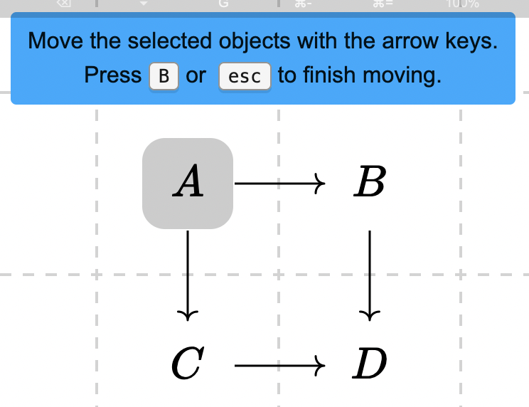

You can move multiple objects at once with both methods, so long as all the objects you want to move are selected.

- To change the source or target of an arrow using the mouse, hover over the edge with your cursor. You will see a circle indicating a clickable region. Click and drag this region to another object or arrow and release the mouse button to change the source or target.
- To change the source of an arrow using the keyboard, first select the arrow in question, press <kbd>,</kbd> (to trigger changing the source), type the label of the new source object or arrow, and press <kbd>Enter</kbd>. To change the source of an arrow using the keyboard, press <kbd>.</kbd> (to trigger changing the target), type the label of the new target object or arrow, and press <kbd>Enter</kbd>.

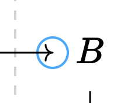

There are also several useful toolbar options for changing the position of every object in the diagram at once (which can be triggered either with the mouse or the keyboard).

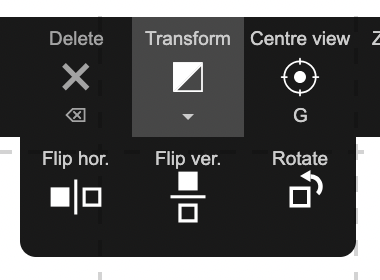

## The queue

When navigating with the keyboard, it is often most efficient to create all the objects and arrows in one go, and then edit them afterwards. Rather than navigate to each object and arrow with the Selection Bar, there is a more efficient option. Once you have created your objects and arrows, press <kbd>Tab</kbd>. This will bring up the **Queue**. Objects and arrow in the Queue will have a <kbd>⇥</kbd> icon to indicate you can navigate to them by pressing <kbd>Tab</kbd>.

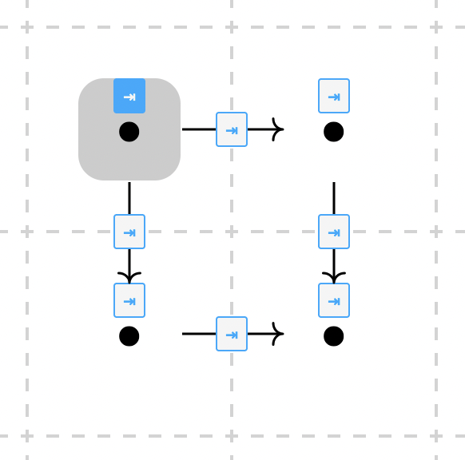

By pressing <kbd>Tab</kbd> repeatedly, you can cycle through each of the objects and arrow in the Queue (hold <kbd>Shift</kbd> to cycle in the reverse order). You can then edit them as you see fit. Whenever you edit an object or arrow, it will be removed from the Queue. If you want to remove something from the Queue without editing it, you can double tap <kbd>Enter</kbd>. Pressing <kbd>Escape</kbd> twice will clear the Queue. Whenever you create a new object or arrow, it will be added to the Queue.

## Exporting your diagram

When you are done with your diagram, you are ready to export it. You have a few options.

- You can **Save** the diagram to the URL (by clicking the button in the toolbar at the top of the window, or using the keyboard shortcut), allowing it to be easily shared with other people.
- You can export the **LaTeX** by clicking the button in the toolbar at the bottom of the window (or by pressing the associated keyboard shortcut, which you can discover by turning Hints on).
- You can export HTML for **embedding** the diagram in a web page (again, with the button at the bottom of the window).

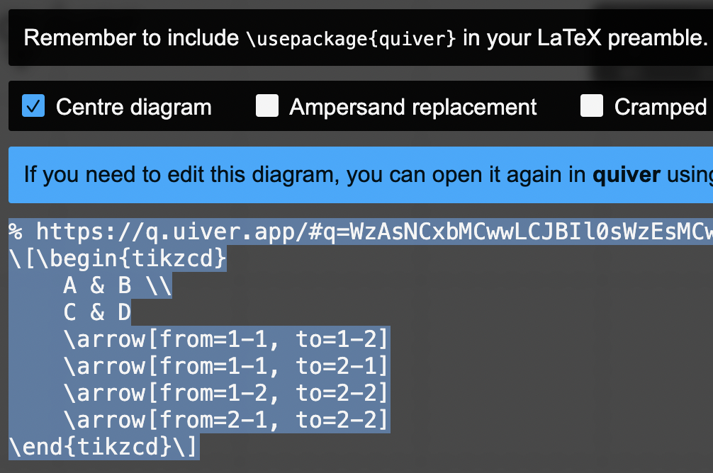

When you export, the text will helpfully be highlighted for you, ready to copy-and-paste. Note that the text includes a link to the **quiver** diagram. This makes it easy to modify the diagram in the future, without having to create the diagram again from scratch: just open the link, and edit away.

Note that you will need to have the [`quiver.sty` package](https://raw.githubusercontent.com/varkor/quiver/master/package/quiver.sty) for diagrams exported by **quiver** to render correctly in LaTeX.

## Importing macros and colours

To use custom macros and colours in **quiver**, create a text file containing the definitions (for instance, the following).

```latex
\newcommand{\cat}{\mathscr}
\newcommand{\psh}{\widehat}
\newcommand{\smcat}{\mathbb}
\newcommand{\yo}{よ}
```

Upload the file to a publicly accessible URL (for instance, [gist.github.com](https://gist.github.com/)), and paste the URL for the raw text into the **Macros** input at the bottom of **quiver**.

Currently, macros may be defined using `\newcommand`, `\newcommand*`, `\renewcommand`, `\renewcommand*`, `\DeclareMathOperator`, and `\DeclareMathOperator*`; and colours may be defined using `\definecolor` (using the colour modes: `rgb`, `RGB`, `HTML`, `gray`).

## Other tips

You can find all the keyboard shortcuts listed in the **Shortcuts** pane, which may be opened from the toolbar at the top of the window.

For example, you can cut, copy, and paste using the usual keyboard shortcuts.

If anything is unclear, or you encounter any problems, you can report it in the [Issue Tracker](https://github.com/varkor/quiver/issues).